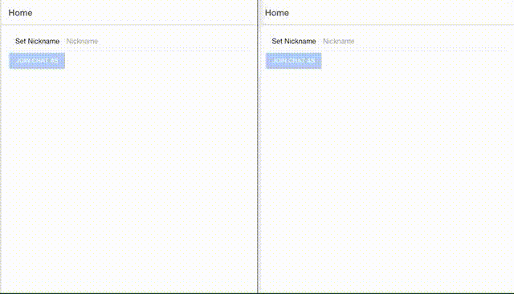

= 03 Simple Chat: Add Authentication and Authorization
:source-highlighter: highlightjs
:highlightjsdir: .
:nofooter:
:icons: font
:toc: left

****
source code: https://github.com/nest-ionic-examples/03-chat-with-auth
****

In https://nest-ionic-examples.github.io/02-chat-with-db[previous tutorial] we added support for MongoDb database to store messages, users, and rooms to our chat application. In this tutorial we are going to add authentication and authorization support. There are several ways of doing this. However, in this tutorial we are going to use `JWT` authentication. At the same time there are also several ways of authenticating with `JWT`. The first one, is to handle the authentication in our server without a third party service. And the second one, is to let a third party single-sign-on server like https://auth0.com/[auth0] to handle the authentication. In this tutorial we are going to discuss the first one, and in other tutorials we are going to discuss the second one.

include::chat-api/README.adoc[]

include::chat-client/README.adoc[]

== Conclusion

As you can see adding Authentication to our project was relatively simple. Furthermore, `express-jwt` give us the huge ability to handle the server-side authentication without writing too much code. As well as `@auth0/angular-jwt` give us great authentication module for angular to handle authentication in the client-side.

Now this application has the ability to limit the pages that a users can enter if he has not logged in previously.

== Comments

++++

<noscript>Please enable JavaScript to view the <a href="https://disqus.com/?ref_noscript">comments powered by Disqus.</a></noscript>
++++
